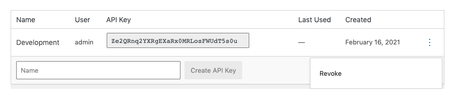

# Security

This document outlines the considerations we've made regarding the security of SatisPress and the resources it creates to provide you with the information you need to help make informed decisions about the security of your site.

If you think you've discovered a vulnerability, please [get in touch privately](https://www.blazersix.com/contact/).

## Introduction

Resources created by SatisPress are private by default and require authentication to access them.

Only users registered in WordPress with the appropriate [capabilities](#capabilities) can access protected resources, which include package artifacts (plugin and theme zip files) and the `packages.json` endpoint.

SatisPress ships with support for accessing protected resources by using API Keys via ["Basic" HTTP Authentication](https://tools.ietf.org/html/rfc2617).

## API Keys

An API Key is a series of 32 randomly generated letters and numbers that look something like this:

```
aUEZYqq6pXlMjdg8swe0rQgMCZAPJNaR
```

API Keys are associated with the user they're created for and inherit the users' capabilities &mdash; a key doesn't provide access to protected resources if the user can't access those resources. API Keys are read-only and limited to accessing SatisPress resources, so if one where to become compromised, an attacker could only view and download whitelisted packages.

To use an API Key with Basic authentication, the API Key should be provided as the username with a password of `satispress`:

__Example Request__

```shell
$ curl https://example.com/satispress/packages.json \
   -u aUEZYqq6pXlMjdg8swe0rQgMCZAPJNaR:satispress
```

### Revoking Keys

API Keys can be revoked in case they are compromised or if you need to remove access for a specific client.



## Basic Authentication Security

__HTTPS / TLS should always be enabled when using Basic authentication.__ Basic authentication is not secure over plain HTTP since it requires sending credentials in clear text with every request.

Composer [requires HTTPS by default](https://getcomposer.org/doc/06-config.md#secure-http), so this generally shouldn't be a problem, but it's worth noting the security implications if you decide to use Basic authentication over plain HTTP.

Also keep in mind that even with HTTPS enabled, the credentials will most likely be stored in clear text at some point, whether it's an `auth.json` file or directly in URLs in `composer.json`.

_WordPress usernames and passwords will no longer work with the default authentication provider included in SatisPress versions after 0.2.3._

## Third-Party Authentication Providers

Third-party authentication providers that hook into the `determine_current_user` filter and take care to account for multiple authentication schemes should also work with SatisPress.

## Protecting Package Artifacts

We've taken several measures to attempt to ensure package artifacts are protected. Most of these approaches are used by several top backup and eCommerce plugins on the market:

* Package artifacts are cached in a randomly named directory to prevent easy discovery.
* An `.htaccess` file is added to the cache directory to deny access to direct requests on Apache servers.
* Download requests can only be made by authenticated users.

_If your site is running on NGINX, you may need to implement custom redirects to deny direct access to the cache directory._

## Capabilities

SatisPress introduces two new primitive capabilities:

- `satispress_download_packages`
- `satispress_view_packages`

And two new meta capabilities:

- `satispress_download_package`
- `satispress_view_package`

The primitive capabilities are added to the administrator role by default during plugin activation and upgrade.

The meta capabilities are the ones that are checked at runtime. There's a mapping between the primitive and meta capabilities in the Capabilities provider.

## Disabling Authentication

If you're using another authentication provider or really don't need authentication, you can disable the built-in server with a single-line filter:

```php
<?php
/**
 * Deregister SatisPress authentication servers.
 */
add_filter( 'satispress_authentication_servers', '__return_empty_array' );
```

_Keep in mind that disabling authentication may make it easier for malicious actors to determine which plugins are being used on your site._

## Other Methods

Securing the SatisPress repository should be possible using the same methods outlined in the [Satis documentation](https://getcomposer.org/doc/articles/handling-private-packages-with-satis.md#security).

[Back to Index](Index.md)
 
