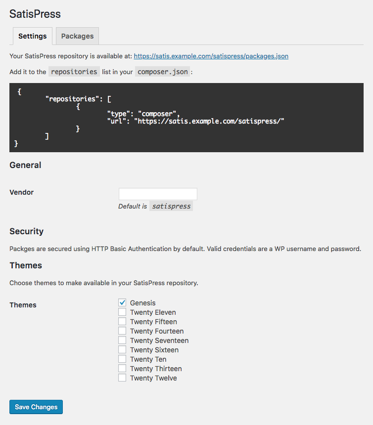

# Settings

At _Settings &rarr; SatisPress_, you'll find the settings page:

## Vendor

When requiring a package from SatisPress, the default would be a package name like `satispress/genesis`.

The "Vendor" field allows this to be changed; a value of `mypremiumcode` would mean the `require` package name would be like `mypremiumcode/genesis`.

## Security

See the document on [Security](Security.md) for more information.

## Themes

See the document on [Whitelisting Plugins and Themes](Whitelisting.md) for more information.

[Back to Index](Index.md)
