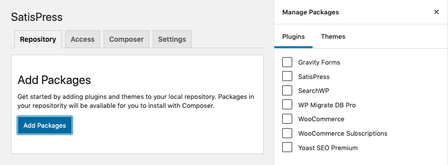
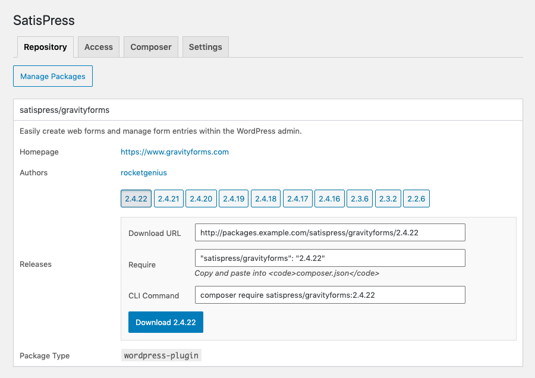
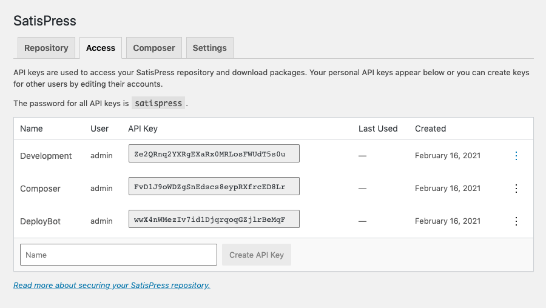

# Getting Started

To get started using SatisPress, a few things need to be done:

1. Add plugins or themes to the repository
2. Create an API Key to access the repository
3. Configure Composer to connect to the repository

## Add Plugins or Themes to the Repository

When plugins and themes are added to the SatisPress repository the version that is currently installed is cached and saved as an artifact (zip file). New releases are also downloaded and saved as soon as WordPress is aware they're available. 

All cached versions are exposed in `packages.json` so they can be required with Composer -- even versions that haven't yet been installed by WordPress!

When you first visit the *Settings &rarr; SatisPress* screen, click the __Add Packages__ button to open the sidebar to select the plugins and themes you want to include in your repository.

Once packages have been added to the repository and releases become available, they can be downloaded directly from the **Repository** tab by clicking the button with the corresponding version number.

## Create an API Key

Cached packages are automatically protected, so you'll need to create an API key on the **Access** tab to access them from Composer.

See the documentation on [Security](security.md) for more information.

## Configure Composer

Finally, you need to add the SatisPress repository to `composer.json` and connect to it using an API key. The **Composer** tab contains instructions for configuring Composer.

See the documentation on [Composer](composer.md) for more information.

[Back to Index](index.md)
