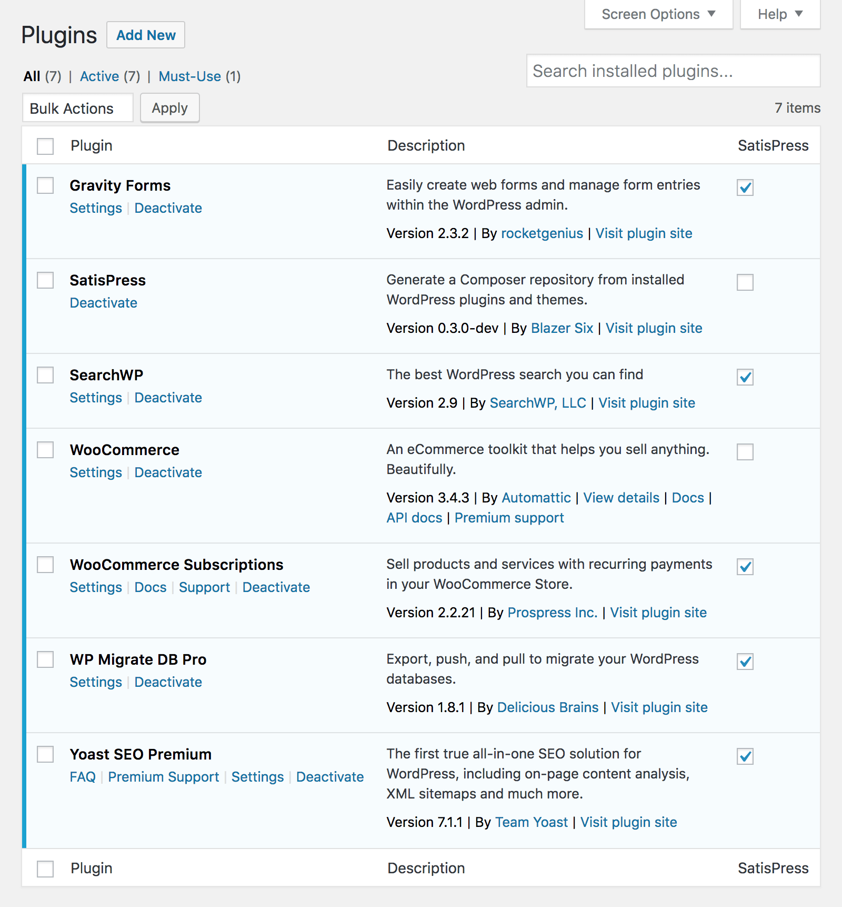
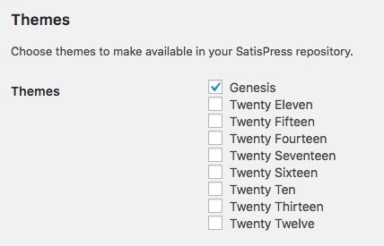

# Whitelisting Plugins and Themes

SatisPress supports standard plugins and themes. These must be whitelisted to be exposed as Composer packages.

Plugins and themes are cached when they're whitelisted and new releases are downloaded and saved as soon as WordPress is notified they're available.

All cached versions are exposed in `packages.json` so they can be required with Composer -- even versions that haven't yet been installed by WordPress!

## Plugins

Plugins can be whitelisted by visiting the _Plugins &rarr; Installed Plugins_ screen in your WordPress admin panel and toggling the checkbox for each plugin in the "SatisPress" column.

## Themes
 
Themes can be toggled on the Settings screen at _Settings &rarr; SatisPress_.

[Back to Index](index.md)
